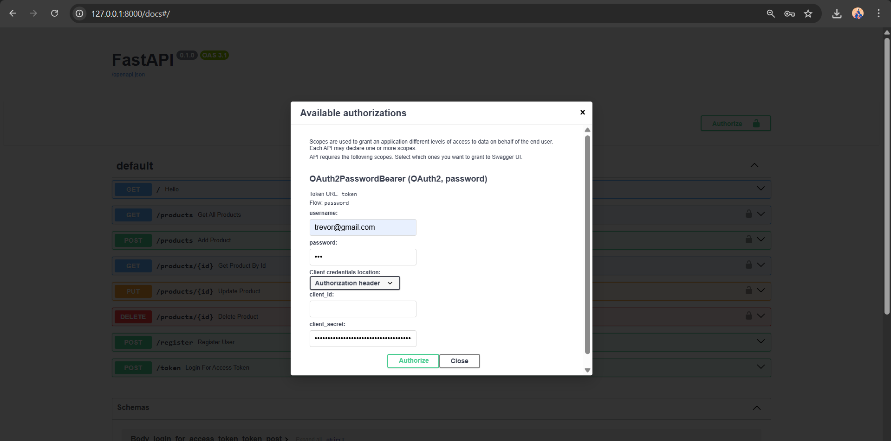
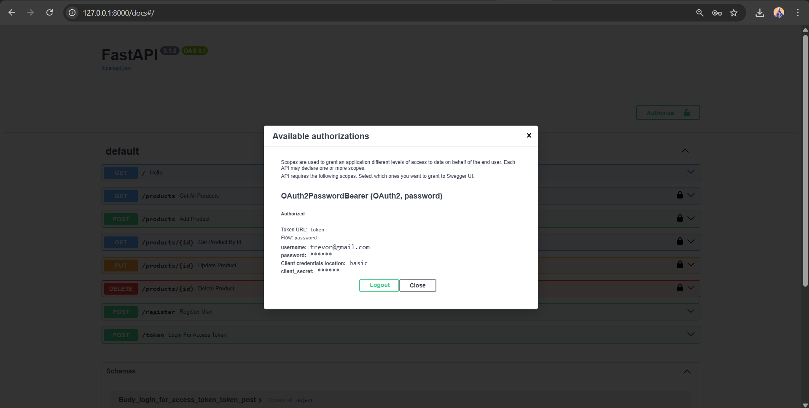
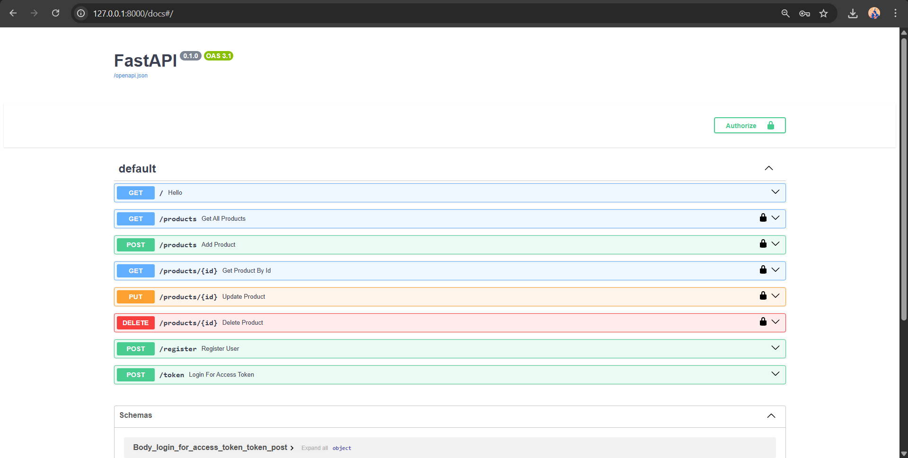
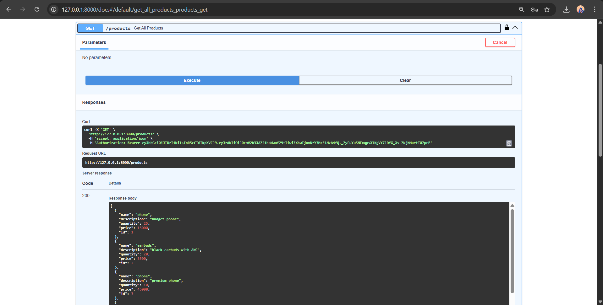
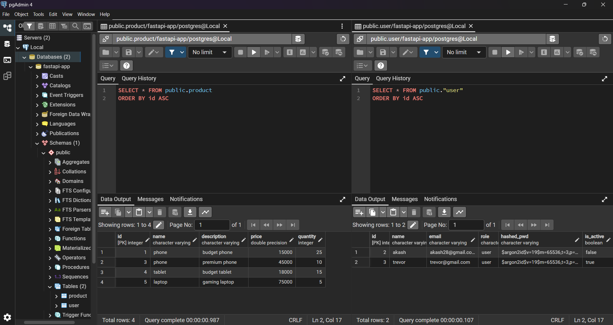
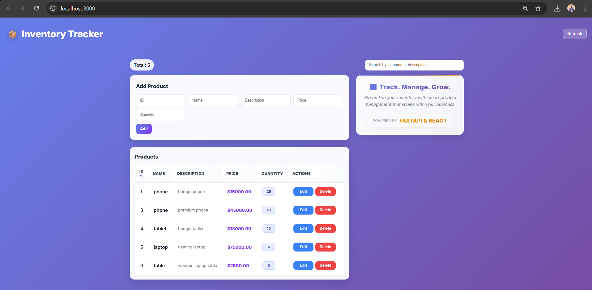

# 📦 Inventory Tracker

**Inventory Tracker** is a side project built to learn and practice **FastAPI backend development**.  
This project is a backend application built using FastAPI that demonstrates real-world backend development practices. It includes secure authentication, role-based authorization, database schema management using Alembic, and structured API design. 
The project is designed to reflect **production-grade** backend architecture, focusing on scalability, maintainability, and best practices commonly used in industry-level FastAPI applications.

---

## 🚀 Project Overview

This project demonstrates:

* RESTful API development using **FastAPI**
* Data validation with **Pydantic**
* Database interaction using **SQLAlchemy**
* **PostgreSQL** integration for persistent storage
* ASGI server implementation via **Uvicorn**
* Secure user authentication using **JWT** and **OAuth2**
* Secure authorization with RBAC(Role Based Access Control)
* **Alembic** migrations for tracking database schema changes
* Version control practices with **Git**

The React frontend was sourced from an open-source resource and integrated with the backend API in early stages of the project. Later the Swagger UI is used for its smooth development experience.

---

## ✨ Backend Features

* Route handling for **CRUD** operations
* **Database** connection and session management
* **ORM**-based data access layer
* **Middleware** configuration
* Request **validation** and serialization
* Automatic **API documentation** (Swagger & Redoc)
* **Exception** handling
* Secure user authentication using **OAuth2 Password Flow**
* **JWT**-based authentication and authorization
* **Password hashing** for secure credential storage
* Protected routes using **dependency injection**
* Generated **Alembic** migrations for database schema management
* Secure authorization with **Role Based Access Control**(RBAC)

---

## 🔗 API Endpoints

* **GET /** – Welcome endpoint
* **GET /products/** – Retrieve all products
* **GET /products/{product\_id}** – Retrieve product by ID
* **POST /products/** – Create a new product
* **PUT /products/{product\_id}** – Update an existing product
* **DELETE /products/{product\_id}** – Delete a product
* **POST /register/** - Register a new user
* **POST /token/** - Login an existing user

---

## 🛠️ Tech Stack

### Backend

* FastAPI
* Pydantic
* SQLAlchemy
* PostgreSQL
* Uvicorn
* Alembic

### Frontend

* React (open-source template)
* Modified some headers, title, request handler etc.

---

## ⚙️ Setup Instructions

### 1️⃣ Create \& activate virtual environment

```bash
python -m venv fastapi-proj
fastapi-proj\\Scripts\\activate.ps1
```

### 2️⃣ Install dependencies

```bash
pip install fastapi uvicorn sqlalchemy psycopg
```

### 3️⃣ Run the backend server

```bash
uvicorn main:app --reload
```

---

## 🌐 Access the Application

* Backend API: http://localhost:8000
* Swagger UI: http://localhost:8000/docs
* ReDoc: http://localhost:8000/redoc
* Frontend: http://localhost:3000

---

## 📸 Screenshots








---

## 📂 Project Structure

```
Inventory-Tracker/
├── main.py
├── models.py
├── database_models.py
├── database.py
├── auth.py
├── frontend/
├── alembic/
├── .gitignore
└── README.md
```

---

## 📌 Learning Outcomes

* Built a real-world FastAPI backend from scratch
* Implemented dependency injection and middleware
* Designed REST APIs with proper validation
* Established database connection with a postgresql database
* Implemented CRUD operations with exception handling
* Integrated backend APIs with a open-source frontend UI
* Introduced secure user authentication and password flow
* Introduced user authorization for RBAC and data safety
* Generated Alembic migrations for safe DB schema evolution
* Followed clean project structure and version control practices with git

---

## 📄 License \& Credits

* Frontend UI adapted from an open-source React project
* Developed backend for learning purposes

