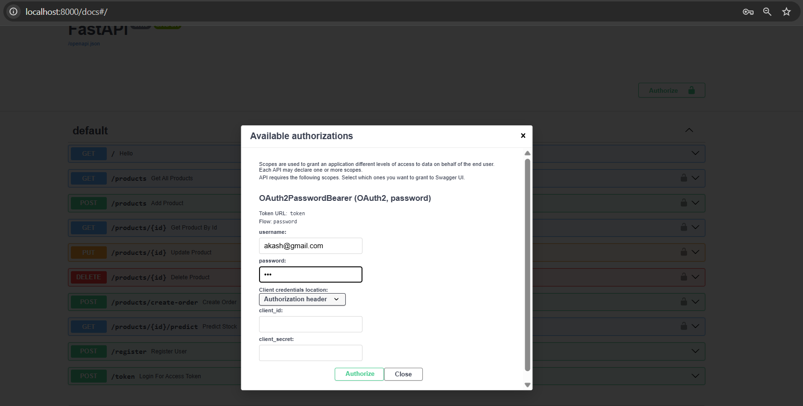
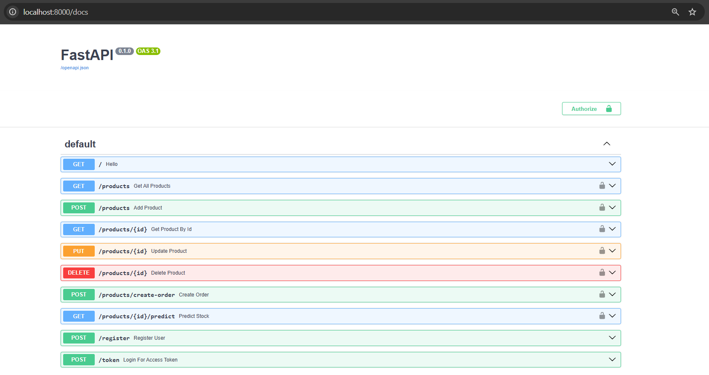
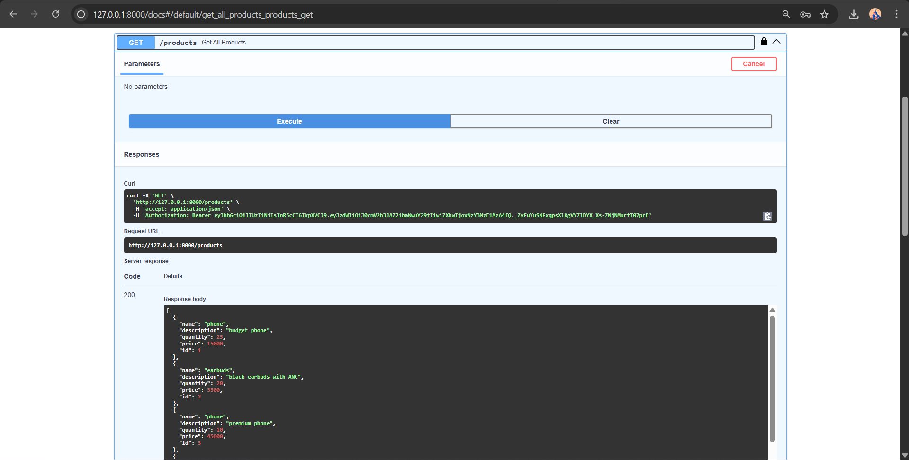
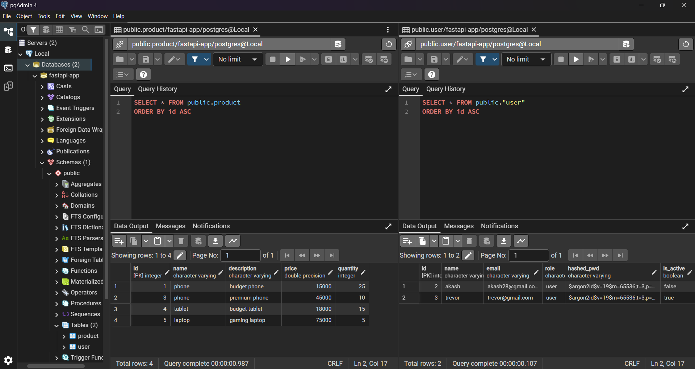

# 📦 Inventory Tracker

**Inventory Tracker** is a side project that I built to learn and practice **FastAPI backend development**.  
This project is a backend application built using FastAPI that demonstrates real-world backend development practices. It includes secure authentication, role-based authorization, database schema management using Alembic and structured API design, ML inference and deployment. 
The project is designed to reflect **production-grade** backend architecture, focusing on scalability, maintainability, and best practices commonly used in industry-level FastAPI applications.

---

## 🚀 Project Overview

This project demonstrates:

* RESTful API development using **FastAPI**
* Data validation with **Pydantic**
* Database interaction using **SQLAlchemy**
* **PostgreSQL** integration for persistent storage
* ASGI server implementation via **Uvicorn**
* Secure user authentication using **JWT** and **OAuth2**
* Secure authorization with RBAC(Role Based Access Control)
* **Alembic** migrations for tracking database schema changes
* **ML model** integration for low stock prediction
* Containerized with **Docker**
* Deployed on **Render**
* Version control practices with **Git**

---

## ✨ Backend Features

* Route handling for **CRUD** operations
* **Database** connection and session management
* **ORM**-based data access layer
* **Middleware** configuration
* Request **validation**
* Automatic **API documentation** (Swagger)
* **Exception** handling
* Secure user authentication using **OAuth2 Password Flow**
* **JWT**-based authentication and authorization
* **Password hashing** for secure credential storage
* Protected routes using **dependency injection**
* Generated **Alembic** migrations for database schema management
* Secure authorization with **Role Based Access Control**(RBAC)
* Separate **SQLite** test database is used to isolate test data from development data
* **pytest** tests cover authentication, role-based access control, and product-related API endpoints
* Exposed a **ML model** as endpoint for prediction 
* **Multi-container setup** using Docker Compose

---

## 🔗 API Endpoints

* **GET /** – Welcome endpoint
* **GET /products/** – Retrieve all products
* **GET /products/{id}** – Retrieve product by ID
* **GET /products/{id}/predict** - Predicts low stock for product
* **POST /products/** – Create a new product
* **PUT /products/{id}** – Update an existing product
* **DELETE /products/{id}** – Delete a product
* **POST /register/** - Register a new user
* **POST /token/** - Login an existing user
* **POST /products/create-order** - Stores order log in table

---

## 🛠️ Tech Stack


* FastAPI
* Pydantic
* SQLAlchemy
* PostgreSQL
* Uvicorn
* Alembic
* pytest
* Docker

---

## ⚙️ Setup Instructions (Local)

### 1️⃣ Create \& activate virtual environment

```bash
python -m venv venv
venv\\Scripts\\activate.ps1
```

### 2️⃣ Install dependencies

```bash
pip install -r requirements.txt
```

### 3️⃣ Run the backend server

```bash
uvicorn main:app --reload --env-file .env
```

---

## 🌐 Access the Application

* Backend API: http://localhost:8000
* Swagger UI: http://localhost:8000/docs

---

## ⚙️ Testing

* Automated tests written using pytest
* Integration tests for FastAPI routes and authentication
* Isolated SQLite test database with transaction rollback
* Dependency overrides for clean test environments

### Run automated tests

```bash
pip install -r tests/requirements-test.txt
```

```bash
pytest
```

---

## 🤖 Machine Learning Integration

This project includes a machine learning component to predict low-stock risk for products.

### 🔍 Overview

A **Random Forest classifier** is used to estimate whether a product is likely to run out of stock based on key inventory features.
The model is trained on **synthetic but realistic data** distributions.
**Feature engineering** is performed at request time using live database data.

Check out my [low stock prediction repo](https://github.com/Akash-ML/low-stock-prediction).

### 📊 Features Used

* Quantity – Current inventory level
* Average Daily Sales – Computed from the last 30 days of order logs
* Days to Restock – Supplier lead time
* Price – Product price

avg_daily_sales is dynamically derived using aggregated order data:
```
Sum of quantities sold in the last 30 days / Divided by 30 
```

### ⚙️ Prediction Endpoint
```
GET /products/{product_id}/predict
```

* Requires owner role (RBAC enforced)
* Computes features in real-time from database
* Returns model prediction
* Example Response
```
{
  "product_id": 1,
  "low_stock_risk": true
}
```
---

## 🐳 Docker & Deployment

The application is containerized using Docker and can be run locally. Also is deployed on Render platform.

### Run with Docker
```
docker-compose up --build
```

### Access the API at:
```
http://localhost:10000
```

### ⚙️ Environment Variables

Environment variables are managed using a .env.docker file and passed to containers at runtime.

### ☁️ Deployment (Render)
* The app is deployed using Docker deployment on Render
* Required environment variables are set in the Render dashboard
* Created a PostgreSQL database instance for production

---

## 📸 Screenshots






---

## 📂 Project Structure

```
Inventory-Tracker/
├── app/
    ├── main.py
    ├── models.py
    ├── database_models.py
    ├── database.py
    ├── auth.py
    ├── config.py
├── tests/
    ├── conftest.py
    ├── test_auth.py
    ├── test_roles.py
    ├── requirements-test.py
├── ml/
    ├── model.py
    ├── inference.py
    ├── model.pkl
├── alembic/
├── Dockerfile
├── docker-compose.yml
├── .dockerignore
├── .gitignore
├── requirements.txt
└── README.md
```

---

## 📌 Learning Outcomes

* Built a real-world FastAPI backend from scratch
* Implemented dependency injection and middleware
* Designed REST APIs with proper validation
* Established database connection with a postgresql database
* Implemented CRUD operations with exception handling
* Introduced secure user authentication and password flow
* Introduced user authorization for RBAC and data safety
* Generated Alembic migrations for safe DB schema evolution
* Learned to automate tests using pytest
* Integrated a machine learning model as a prediction API endpoint
* Followed clean project structure and version control practices with git

---

## 📄 License \& Credits

* Developed for learning purposes
